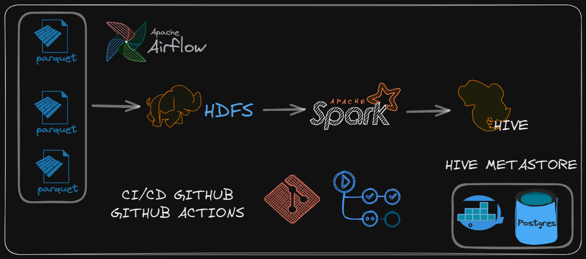
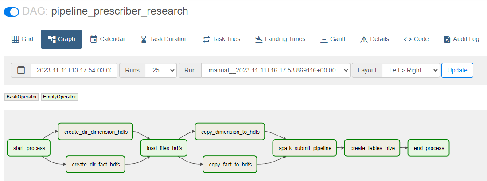
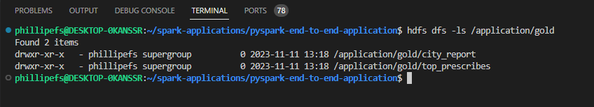
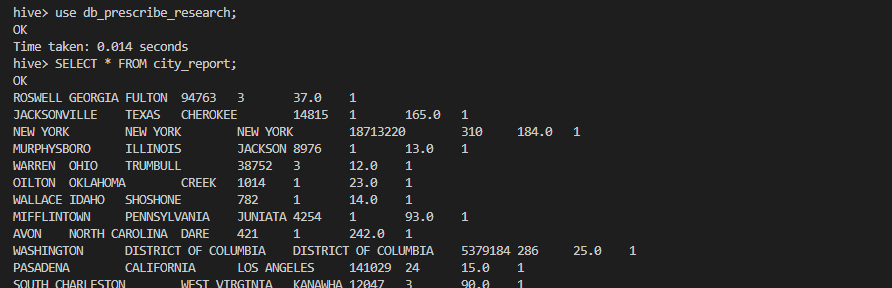

# Architecture

<div aling="center">
  
</div>

### Install Airflow Local
1. Config Airflow Home
   ```
   export AIRFLOW_HOME=~/airflow
   ```
2. Install Airflow
   ```
    AIRFLOW_VERSION=2.7.2
    PYTHON_VERSION="$(python --version | cut -d " " -f 2 | cut -d "." -f 1-2)"
    CONSTRAINT_URL="https://raw.githubusercontent.com/apache/airflow/constraints-${AIRFLOW_VERSION}/constraints-${PYTHON_VERSION}.txt"
    pip install "apache-airflow==${AIRFLOW_VERSION}" --constraint "${CONSTRAINT_URL}"
   ```
3. Create User and Start
   ```
   airflow db migrate
   airflow users create \
      --username admin \
      --firstname Phillipe \
      --lastname Santos \
      --role Admin \
      --email airflow@airflow.com  
    airflow webserver && airflow scheduler
   ```
4. Acess Airflow Local
   ```
   http://localhost:8080/home

### DAG Pipeline
<div aling="center">
  
</div>

### Files HDFS


### Select External Tables HIVE

